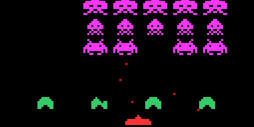

# Mars Invaders

## Description

**Space invaders** est un jeu d'arcade sorti en 1978. Considéré comme le premier archétype du shoot them up, il est aussi l'un des titres les plus influents et célèbres de l'histoire du jeu vidéo.

[En savoir plus](https://fr.wikipedia.org/wiki/Space_Invaders)

## But du jeu

Le joueur, représenté par un canon en bas de l'écran, doit éliminer des vagues d'aliens en leur tirant dessus avant que ces-derniers n'atteignent les habitations, et ce en évitant leur tirs. Le joueur perd également la partie lorsque toutes les habitations sont détruites.

## Guide d'utilisation  

Pour jouer à *Mars Invaders*, il faudra vous munir du simulateur [Mars](http://courses.missouristate.edu/KenVollmar/mars/). Pour éviter la perte de la bonne version, vous la trouverez dans ce dépot : Mars4_5.jar
1. Chargez le fichier invader.s dans Mars
2. Pour avoir l'affichage, ouvrez le menu « Tools » et sélectionnez « Bitmap Display ». Dans la fenêtre qui apparaît, fixez les deux paramètres « Unit Width & Height in Pixels » à la valeur 4 et cliquez sur « Connect to MIPS ».
3. Pour l’entrée clavier du jeu, ouvrez le menu « Tools » et sélectionnez « Keyboard and Display MMIO Simulator » et cliquez sur « Connect to MIPS »
4. Vous pouvez maintenant compiler le fichier puis l'executer.

## Commandes

### Au démarrage

* *'5'* : Lancement du jeu

### En Jeu:

* *'4'* : Déplacer le canon vers la gauche.
* *'5'* : Faire feu (*Boom*).
* *'6'* : Déplacer le canon vers la droite.

## Auteurs

GIRARD Gaëlle & LETT Lucas
